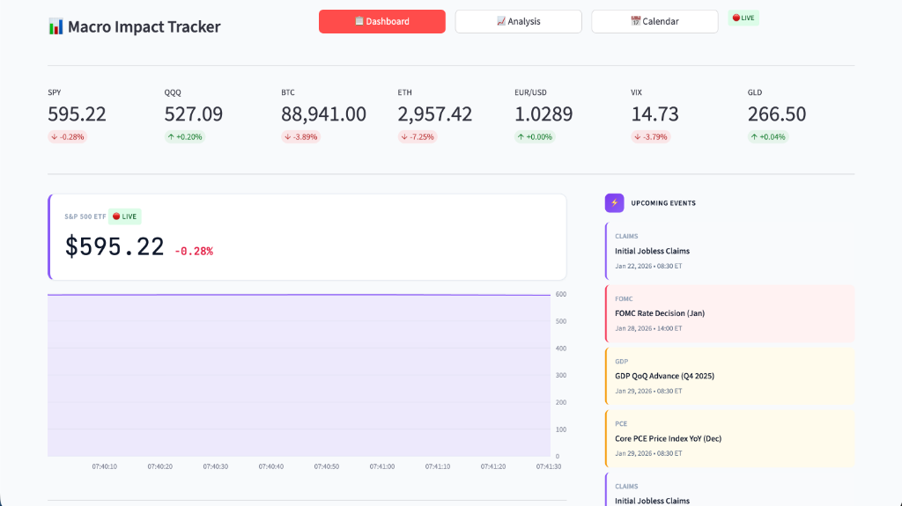
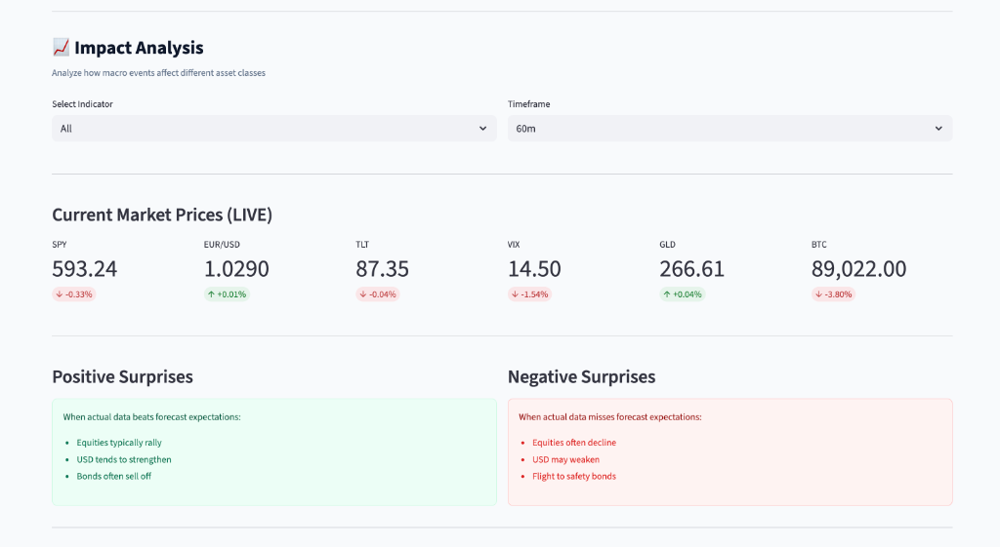
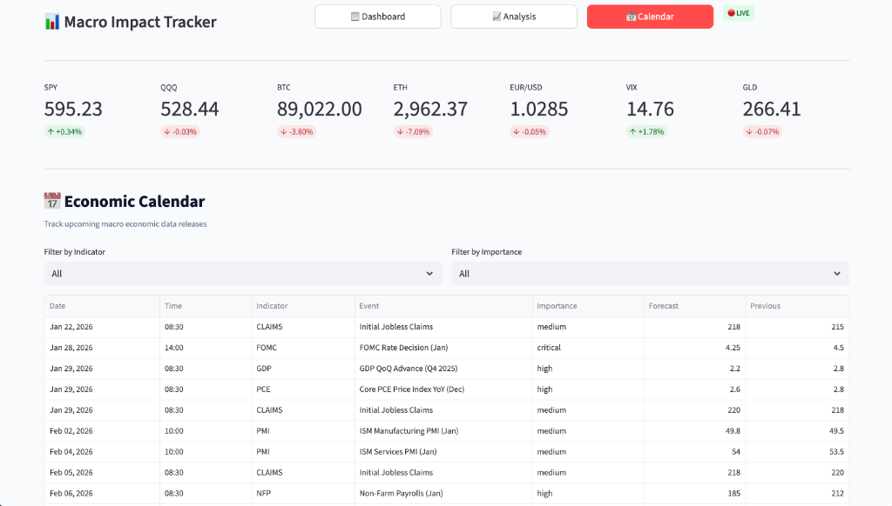

# Macro Impact Tracker

This Macro Impact Tracker is a real-time web dashboard that monitors and analyzes how major economic data releases (like CPI, NFP, and FOMC decisions) immediately impact prices across equities, forex, bonds, commodities, and volatility indices.

## Features

- **Real-time market monitoring** across 14+ assets (equities, FX, bonds, commodities, volatility)
- **Economic event tracking** for scheduled economic releases
- **Impact analysis** measuring market reactions at 1, 5, 15, 30, and 60 minute intervals (work in progress)
- **Interactive dashboards** with price charts and market tickers
- **Economic calendar** with upcoming events through 2026

## Getting Started

```bash
# Install dependencies
npm install

# Run the application (starts both server and client)
npm run dev
```

The app runs on `http://localhost:5173` with the backend on port `3001`.

## Demo

### Dashboard View


### Market Impact Analysis


### Economic Calendar


## Asset Classes Tracked

| Category | Assets |
|----------|--------|
| Equities | SPY, QQQ, IWM, DIA |
| Forex | EUR/USD, GBP/USD, USD/JPY, DXY |
| Bonds | TLT, IEF, HYG |
| Volatility | VIX, VVIX |
| Commodities | GLD, USO |

## Economic Indicators

- CPI, NFP, PMI, FOMC, GDP, PPI, PCE,
- Retail Sales, Jobless Claims
